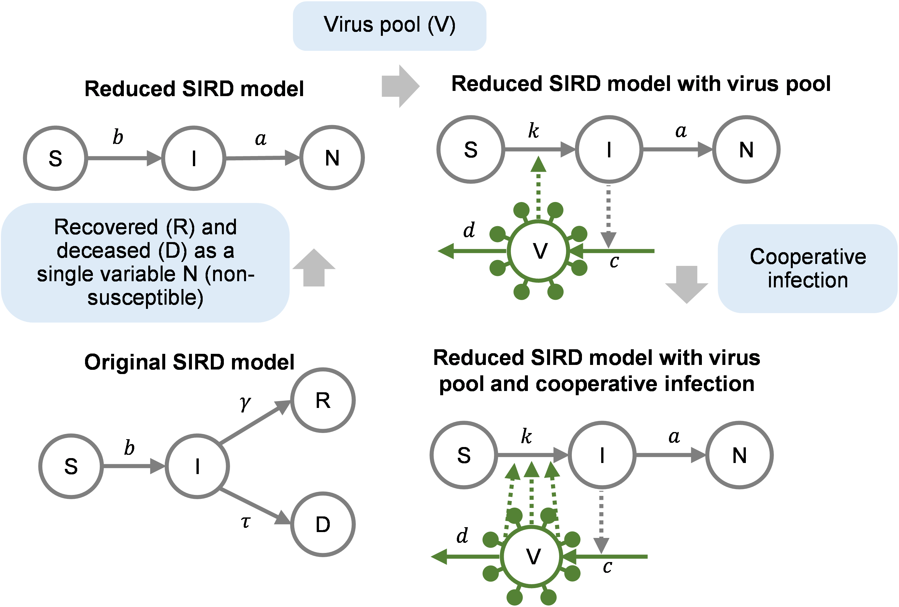

# COVID_19_models
# Introduction
This project includes mathematical models for the COVID-19 (SARS-CoV-2) pandemic in nine countries, including USA, Italy, Spain, Germany, France, UK and Turkey. These models are derived from the susceptible, infected, recovered and deceased (SIRD) model in computational epidemiology. Three variation of the SIRD model including reduced SIRD model, reduced SIRD model with virus pool, and reduced SIRD model with virus pool and cooperative infection are considered.



The scripts were developed and tested on MATLAB R2019a.

# File and folder descriptions
- **Fit_COVID_models.m**: MATLAB script for fitting a model (Reduced SIRD, Reduced SIRD with virus pool, or Reduced SIRD with virus pool and cooperative infection) to COVID-19 transmission data in a country.
- **batchRun.sh**: Shell script for fitting all three models to COVID-19 transmission data in all nine countries.
- **Simulate_COVID_models.m**: MATLAB script for simulation of the cooperative infection model (i.e. reduced SIRD model with virus pool and cooperative infection) with parameter sets estimated for different countries.
- **ActiveCases.csv**: Input dataset including time-course data of active case numbers (i.e. numbers of infected individuals) within the time period of Feb 15, 2020 to Apr 3, 2020 in the nine countries.
- **TotalCases.csv**: Input dataset including time-course data of total case numbers (i.e. total numbers of infected and recovered/deceased individuals) within the time period of Feb 15, 2020 to Apr 3, 2020 in the nine countries.
- **Functions**: MATLAB functions required by `Fit_COVID_models.m` and `Simulate_COVID_models.m`

# Running the code
- **Fit the models to COVID-19 transmission data**

This is done by the shell script `batchRun.sh` which executes the the MATLAB script `Fit_COVID_models.m` for each combination of model and country in a parallel fashion. 
``` bash
./batchRun.sh
```
- **Simulate the models with parameter sets estimated by fitting COVID-19 transmission data**

This can be done by the MATLAB script `Simulate_COVID_models.m` after all model fitting processes in the previous step are completed. To do this, simply execute `Simulate_COVID_models.m`. This could be done through the MATLAB GUI or by running the command below:
``` bash
matlab -r Simulate_COVID_models
```

# Contact
ziwei.dai@duke.edu

